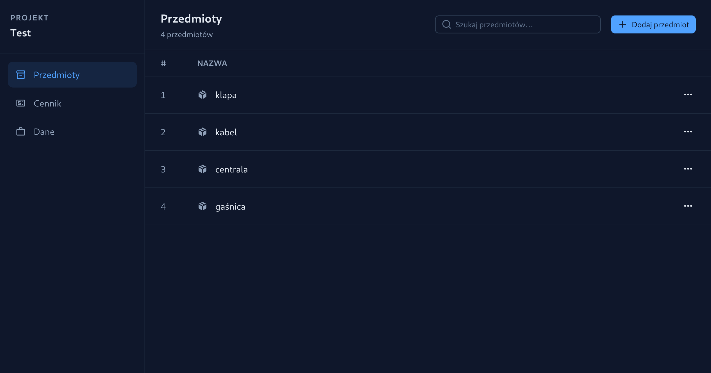

# ProjetkAGB

> Full-stack project management system for tracking projects, products, pricing lists, and warehouse inventory — built with **Nuxt 4** and **Express.js**.

<p align="center">
  
</p>

---

## Table of Contents

- [Overview](#overview)
- [Features](#features)
- [Tech Stack](#tech-stack)
- [Project Structure](#project-structure)
- [Getting Started](#getting-started)
  - [Prerequisites](#prerequisites)
  - [Installation](#installation)
  - [Running the App](#running-the-app)
- [API Endpoints](#api-endpoints)
- [Authentication & Authorization](#authentication--authorization)
- [Environment Variables](#environment-variables)
- [License](#license)

---

## Overview

**ProjetkAGB** is an internal business tool for managing construction/installation projects. It provides user authentication with role-based access control, project lifecycle management (create → edit → archive → delete), product & pricing list integration, and a warehouse module — all surfaced through a responsive Vue-based UI.

---

## Features

| Area | Capabilities |
| --- | --- |
| **Authentication** | Session-based login with bcrypt password hashing |
| **Authorization** | Role-based access (admin / per-project permission levels 1-7) |
| **Projects** | Create, view, archive, and delete projects with linked products |
| **Products** | Add / remove / update product quantities within a project |
| **Pricing Lists** | Manage multiple pricing lists with per-product prices & currencies |
| **Responsive UI** | Mobile & desktop layouts via `nuxt-viewport` and Tailwind CSS |

---

## Tech Stack

### Frontend — `nuxt-app/`

| Technology | Version |
| --- | --- |
| [Nuxt](https://nuxt.com) | 4.x |
| [Vue](https://vuejs.org) | 3.5 |
| [Nuxt UI](https://ui.nuxt.com) | 4.x |
| [Tailwind CSS](https://tailwindcss.com) | 4.x |
| [Vue Router](https://router.vuejs.org) | 5.x |
| [nuxt-viewport](https://github.com/mvrlin/nuxt-viewport) | 2.x |

### Backend — `backend/`

| Technology | Version |
| --- | --- |
| [Express](https://expressjs.com) | 4.x |
| [better-sqlite3](https://github.com/WiseLibs/better-sqlite3) | 11.x |
| [bcrypt](https://github.com/kelektiv/node.bcrypt.js) | 5.x |
| [express-session](https://github.com/expressjs/session) | 1.x |
| [body-parser](https://github.com/expressjs/body-parser) | 2.x |
| [cors](https://github.com/expressjs/cors) | 2.x |

---

## Project Structure

```
ProjetkAGB/
├── backend/
│   ├── package.json
│   └── src/
│       ├── index.js              # Express entry point (port 3003)
│       ├── db.js                 # SQLite database connection
│       ├── middleware/
│       │   ├── auth.js           # Session guard middleware
│       │   └── authorization.js  # Role & permission checks
│       ├── routes/
│       │   ├── auth.js           # Login / logout / session
│       │   ├── projects.js       # Project CRUD + product linking
│       │   ├── products.js       # Product catalog
│       │   └── pricingList.js    # Pricing list management
│       └── utils/
│           └── helpers.js        # Shared utility functions
│
├── nuxt-app/
│   ├── package.json
│   ├── nuxt.config.ts
│   └── app/
│       ├── app.vue               # Root layout
│       ├── app.config.ts         # UI theme / color tokens
│       ├── assets/css/           # Global styles
│       ├── components/
│       │   ├── PricingList.vue   # Pricing list component
│       │   └── ProjectsList.vue  # Projects list component
│       ├── middleware/
│       │   └── auth.global.js    # Global auth route guard
│       └── pages/
│           ├── index.vue         # Landing / redirect
│           ├── login.vue         # Login page
│           ├── about.vue         # About page
│           ├── user.vue          # User management
│           └── project/
│               └── [id].vue      # Dynamic project detail page
│
├── .gitignore
├── .prettierrc
└── README.md
```

---

## Getting Started

### Prerequisites

- **Node.js** ≥ 18 (tested with v25.1)
- **npm** ≥ 9

### Installation

```bash
# Clone the repository
git clone https://github.com/CeTeq/ProjetkAGB.git
cd ProjetkAGB

# Install backend dependencies
cd backend
npm install

# Install frontend dependencies
cd ../nuxt-app
npm install
```

### Running the App

You need to start both the backend and frontend servers.

**1. Start the backend** (runs on port `3003`):

```bash
cd backend
node src/index.js
```

**2. Start the frontend** (runs on port `3000`):

```bash
cd nuxt-app
npm run dev
```

Open your browser at **`http://localhost:3000`** — you will be redirected to the login page.

---

## API Endpoints

All API routes are prefixed with `/api` and require an active session unless noted otherwise.

### Auth

| Method | Endpoint | Description |
| --- | --- | --- |
| `POST` | `/api/login` | Authenticate user |
| `POST` | `/api/logout` | Destroy session |
| `GET` | `/api/me` | Get current user info |

### Projects

| Method | Endpoint | Description |
| --- | --- | --- |
| `GET` | `/api/getProjects` | List all projects the user has access to |
| `GET` | `/api/project?id=` | Get project details with linked products |
| `GET` | `/api/projectPermission?projectID=` | Check user's permission for a project |
| `POST` | `/api/createProject` | Create a new project *(admin)* |
| `POST` | `/api/project/newProject` | Create project with order details |
| `POST` | `/api/project/archive` | Archive / unarchive a project |
| `POST` | `/api/deleteProject` | Delete a project and all related data *(admin)* |

### Project Products

| Method | Endpoint | Description |
| --- | --- | --- |
| `POST` | `/api/project/addNewelement` | Add product to a project |
| `POST` | `/api/project/updateItem` | Update product quantities |
| `POST` | `/api/project/deleteItem` | Remove product from a project |

### Pricing Lists & Products

| Method | Endpoint | Description |
| --- | --- | --- |
| — | `/api/products` | Product catalog endpoints |
| — | `/api/pricingList` | Pricing list management endpoints |


---

## Authentication & Authorization

### Authentication

The app uses **session-based authentication** powered by `express-session`. Passwords are hashed with `bcrypt`. The frontend enforces auth via a [global Nuxt middleware](nuxt-app/app/middleware/auth.global.js) that checks the `/api/me` endpoint on every route change.

### Authorization (Permission Levels)

| Level | Role | Capabilities |
| --- | --- | --- |
| `admin` | Administrator | Full access — create, delete, manage all projects and users |
| `7` | Project Owner | Full project control |
| `2` | Editor | Add, update, and remove products from projects |
| `1` | Viewer | Read-only access to assigned projects |
| `0` | No Access | Denied |

Permissions are stored per-user per-project in the `permissions` table.

---

## Environment Variables

| Variable | Used By | Description |
| --- | --- | --- |
| `DEV_IP` | Backend | IP address for CORS origin and server binding |
| `VITE_DEV_IP` | Frontend | Backend API host (used in auth middleware & API calls) |

Set these before running the app:

```bash
# Example
export DEV_IP=192.168.1.100
export VITE_DEV_IP=192.168.1.100
```

---

## License

This project is licensed under the [Creative Commons Attribution-NonCommercial-ShareAlike 4.0 International (CC BY-NC-SA 4.0)](./LICENSE).

[](https://creativecommons.org/licenses/by-nc-sa/4.0/)
